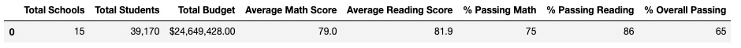
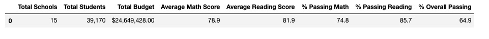
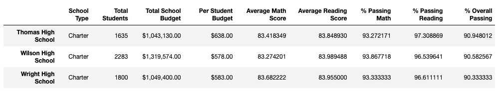
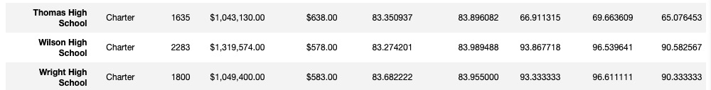

# **School_District_Analysis**
## **Overview**
The following analysis is performed  on a school district dataset. We want to provide insight about school performance, trends, and patterns for discussions and decisions at the school and district level. Our school district dataset consists of student funding and student's test scores. Math and reading scores, respectively. 
Tasks performed:

1. Adjust the reading and math scores for the 9th graders at Thomas High School due to evidence of academic dishonesty.
2. Create an overview of the key metrics for each school, presented in a table format
3. Created tables presenting each of the following metrics:
    3.1 Top 5 and bottom 5 performing schools, based on the overall passing rate
    3.2 The average math score received by students in each grade level at each school
    3.3 The average reading score received by students in each grade level at each school
    3.4 School performance based on the budget per student
    3.5 School performance based on the school size 
    3.6 School performance based on the type of school

## **Results**

1. As we can observe in the images below, there was no major effect on the key metrics for the district summary after removing the math and reading grades  of 9th graders at Thomas High School. As expected the only slight changes occured in the variables linked to math and reading grades .

 **Image 1- District summary before**

**Image 2- District Summary After**

2. The school summary was only affected in the row related to Thomas High School as we can observe below. Especifically the percentage passing math, reading, and overall passing.

**Image 3 - School Summary Before**

**Image 4- School Summary After**

3. After removing the ninth graders math and reading scores, Thomas High Scool rank reamined as the second best in the school summary.  

4.1. Math and reading scores: grade are not availabe for 9th graders because they were remove from our analysis.

4.2. Scores by school spending, size and type  were not affected after removing the ninth graders.

## **Summary**
Four major changes after removing the reading and math scores for the ninth grade at Thomas High School were:
1. The Math and reading scores are not available for night graders at Thomas High School.
2. The new total number of students after subtracting the 9thn graders dropped by 461.
3. The passing reading for disctrict summary dropped from 86% to 85.7%
4. The passing math an passing reading percentages for district summary were affected the most after removing the ninth grade at Thomas High School.

